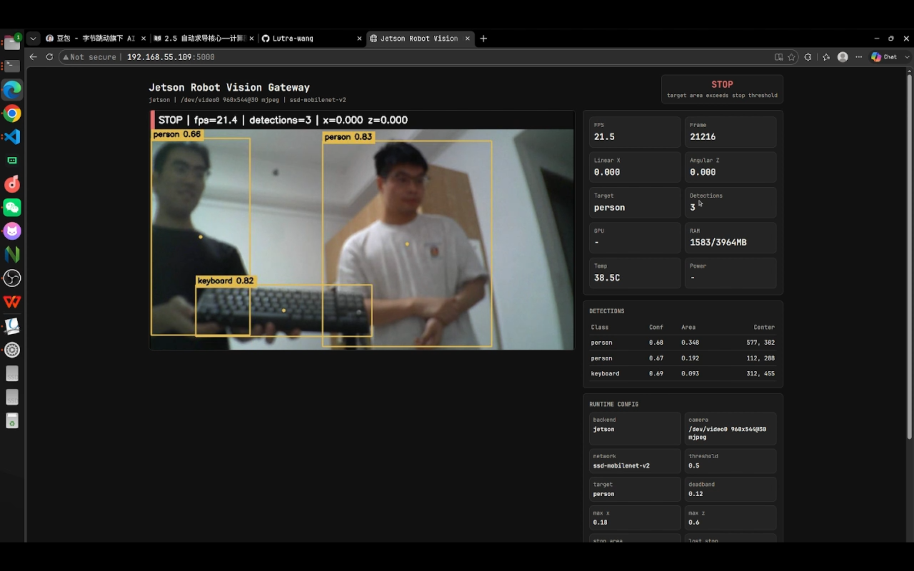
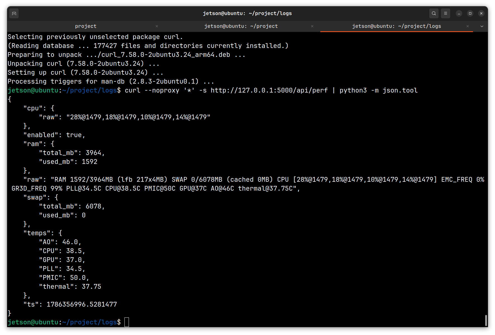
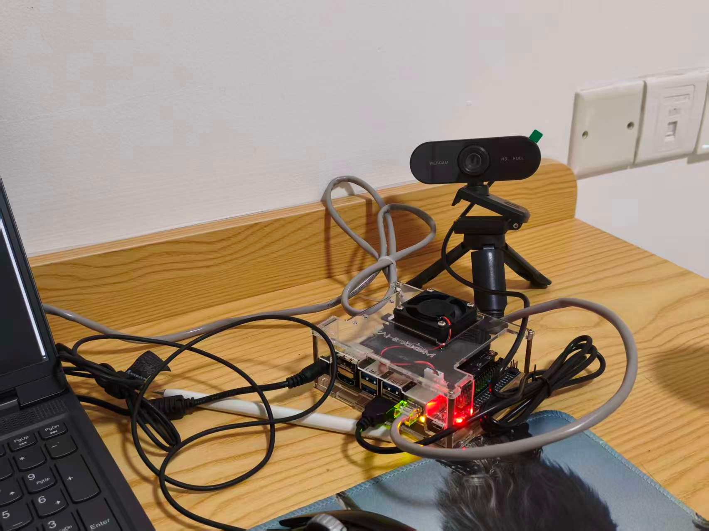
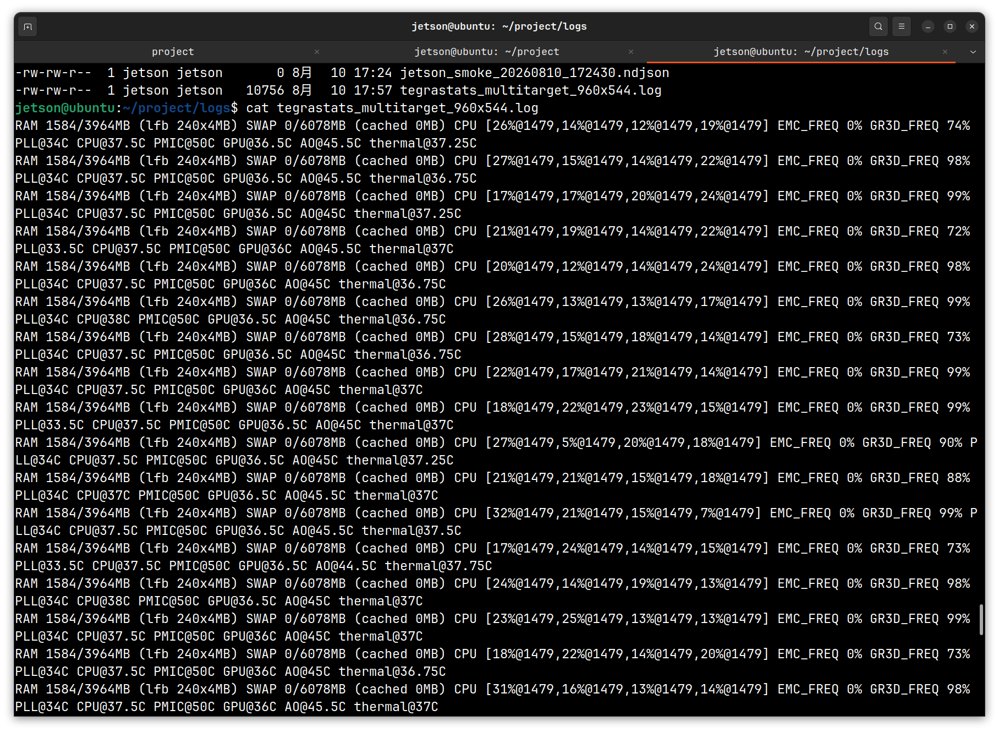

# Jetson Robot Vision Gateway

基于 Jetson Nano + TensorRT 的机器人端侧视觉感知与控制网关。项目完成了 USB 摄像头采集、端侧目标检测、结构化感知 JSON、目标跟随状态机、速度指令生成、Web 可视化、运行时监控和 Jetson headless 性能优化。

当前硬件为 Jetson Nano + USB 摄像头，暂未接入真实底盘或机械臂。因此项目第一阶段聚焦“感知到控制指令”的端侧闭环，为后续 ROS2 `/cmd_vel` bridge 或机器人主控接入预留接口。

## Highlights

- 在 Jetson Nano B01 / L4T R32.7.4 上部署 `jetson-inference`，使用 SSD-Mobilenet-v2 + TensorRT 完成端侧目标检测。
- 设计 `mock / jetson` 双后端检测框架，本地开发与 Jetson 部署共用统一数据模型。
- 实现 `TRACKING / LOST / STOP` 目标跟随状态机，将检测框中心偏差和面积占比映射为 `linear_x / angular_z`。
- 搭建 Flask Web Dashboard，提供实时 MJPEG、检测框、FPS、控制状态、运行配置和 Jetson 性能监控。
- 参考 NVIDIA Jetson skills 完成 headless、`nvpmodel`、`jetson_clocks` 和参数调优，形成可复现部署流程。

## Verified Baseline

| Item | Result |
| --- | --- |
| Device | Jetson Nano Developer Kit, 4GB |
| OS | L4T R32.7.4 / Ubuntu 18.04 / Python 3.6 |
| Camera | USB camera `/dev/video0`, MJPG `960x544@30` |
| Model | SSD-Mobilenet-v2, TensorRT via `jetson-inference` |
| Detection loop | about `21.4-21.6 FPS` |
| Web stream | MJPEG `10 FPS`, JPEG quality `70` |
| Perf API | `/api/perf`, parsed from `tegrastats` |
| Multi-target runtime | RAM `1584/3964 MB`, SWAP `0 MB`, GR3D avg about `89.7%` |
| Headless gain | used RAM `-518 MB`, available memory `+528 MB`, free memory `+732 MB` |
| Loopback | `/api/status`, `/api/perf`, `/api/stream.mjpg` verified |

Jetson Nano uses unified CPU/GPU memory, so RAM numbers below represent shared system memory, not separate discrete VRAM.

## Runtime Evidence

Web dashboard: multi-target detection



`/api/perf`: structured runtime metrics



Hardware setup



`tegrastats`: runtime resource log



Representative `960x544@30` MJPG multi-target run:

| Metric | Result |
| --- | --- |
| Web dashboard FPS | about `21.5 FPS` |
| Detections | `person`, `person`, `keyboard` |
| Shared memory | `1584/3964 MB`, stable during sample |
| SWAP | `0/6078 MB` |
| GR3D | `71%-99%`, avg about `89.7%` |
| Temperature | CPU up to about `39 C`, GPU about `36-37 C` |

Headless comparison summary:

| Mode | systemd target | Display manager | Used RAM | Free RAM | Available RAM | Idle tegrastats RAM avg |
| --- | --- | --- | --- | --- | --- | --- |
| Desktop | `graphical.target` | active | `725 MB` | `2652 MB` | `3069 MB` | `806.4 MB` |
| Headless | `multi-user.target` | inactive | `207 MB` | `3384 MB` | `3597 MB` | `240.1 MB` |

Headless mode releases memory from desktop services such as `gdm3`, `Xorg`, `compiz`, `unity`, `evolution`, and `nautilus`, leaving more memory headroom for detection, streaming, logging, or future ROS2 bridge processes.

## Architecture

```mermaid
flowchart LR
  A[USB Camera<br/>/dev/video0<br/>MJPG 960x544@30] --> B[videoSource]
  B --> C[cudaImage]
  C --> D[detectNet<br/>SSD-Mobilenet-v2<br/>TensorRT]
  D --> E[PerceptionFrame JSON]
  E --> F[TargetTrackingPolicy]
  F --> G[PolicyOutput<br/>linear_x / angular_z]
  E --> H[Flask Web Dashboard]
  F --> H
  H --> I[/api/status<br/>/api/perf<br/>/api/stream.mjpg]
  G --> J[stdout / UDP JSON<br/>future ROS2 bridge]
```

## Quick Start

Local mock mode:

```bash
python3 -m venv .venv
source .venv/bin/activate
pip install -r requirements-dev.txt
PYTHONPATH=src python3 -m jrvg.main --backend mock --frames 30
```

Jetson smoke test:

```bash
cd ~/project/jetson_inference
bash scripts/smoke_jetson_inference.sh /dev/video0
```

Jetson web demo:

```bash
cd ~/project/jetson_inference
CONFIG=config/jetson_usb_960x544.json \
STREAM_FPS=10 \
JPEG_QUALITY=70 \
ENABLE_TEGRASTATS=1 \
bash scripts/run_web_jetson_maxperf.sh /dev/video0
```

Open from PC:

```text
http://<jetson-ip>:5000
```

Loopback test from PC:

```bash
bash scripts/loopback_jetson_web.sh <jetson-ip> 5000
```

## HTTP API

```text
GET /api/status        # current perception, policy, runtime, perf snapshot
GET /api/status.ndjson # streaming JSON lines
GET /api/perf          # Jetson tegrastats snapshot
GET /api/stream.mjpg   # annotated MJPEG stream
```

Example control output:

```json
{
  "state": "TRACKING",
  "target": "person",
  "cmd": {
    "linear_x": 0.12,
    "angular_z": -0.25
  },
  "reason": "target tracked"
}
```

## Project Layout

```text
.
├── config/                 # runtime configs for local and Jetson camera modes
├── docs/                   # architecture, deployment, report, performance, resume notes, assets
├── scripts/                # probe, sync, smoke test, web run, loopback, perf scripts
├── src/jrvg/               # project source code
├── third_party/README.md   # external dependency instructions; sources are not vendored
├── requirements-dev.txt
├── requirements-jetson.txt
├── pyproject.toml
└── setup.py
```

## Documentation

- [Development Report](docs/development_report.md): actual development process, issues, fixes, and final state.
- [Architecture](docs/architecture.md): modules, data flow, runtime modes, and ROS2 bridge boundary.
- [Jetson Deployment](docs/deployment.md): IP discovery, sync, dependency setup, `jetson-inference`, web demo, loopback.
- [Performance](docs/performance.md): current metrics, collection commands, and tuning plan.
- [Roadmap](docs/roadmap.md): completed scope, next work, and explicit non-goals.
- [Resume Summary](docs/resume.md): role, project summary, and interview-oriented bullets.

## Scope Boundary

This repository demonstrates an edge perception gateway, not a full robot motion system. It generates robot-style velocity commands, but real actuator control and ROS2 `/cmd_vel` publishing are reserved for the next integration stage.
